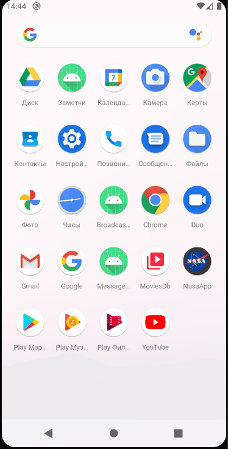
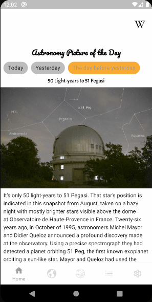
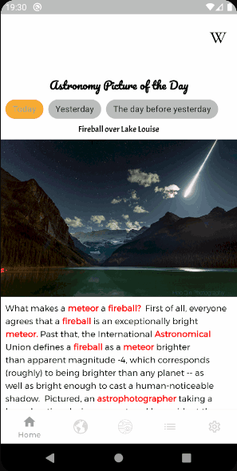
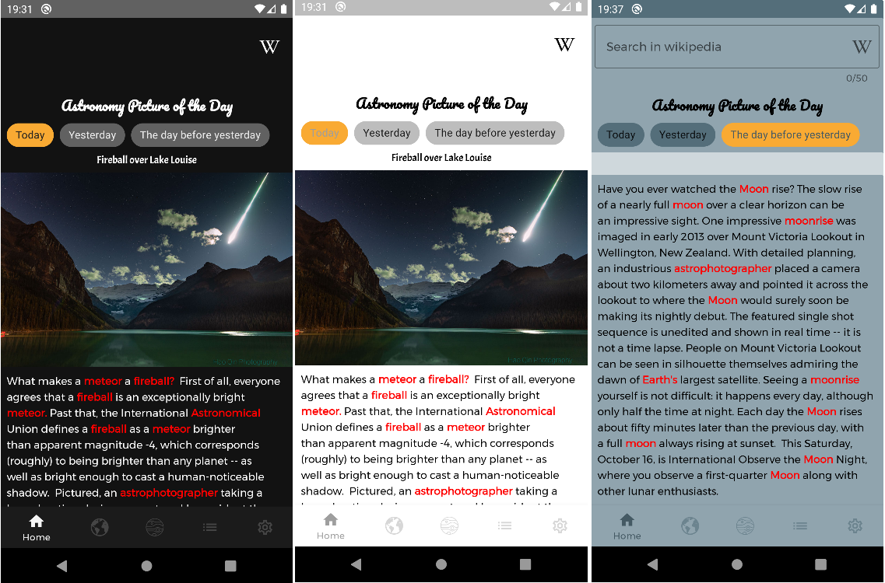
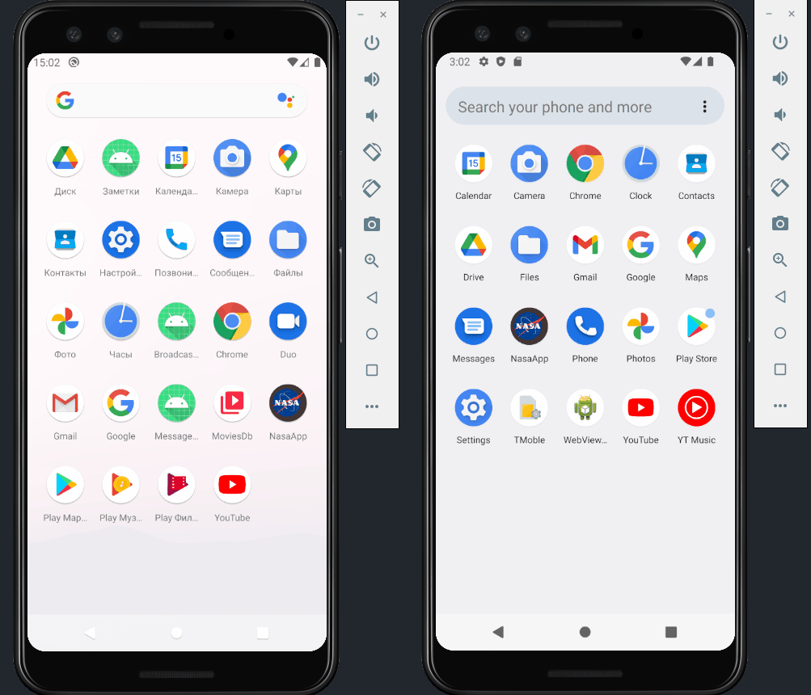
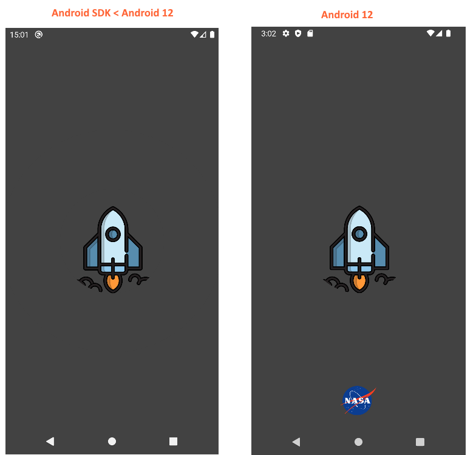

# Домашнее задание 1.
1. Изучите API NASA, который мы будем использовать в течение курса, и продумайте, как вы выстроите своё приложение, какие там будут экраны.
2. Создайте первый экран приложения с фотографией дня.
3. Добавьте описание (приходит с сервера) под фотографией в виде текстовой подписи или в виде BottomSheet.
4. Добавьте текстовое поле для поиска неизвестных слов в «Википедии».
5. Добавьте адаптивную иконку для вашего приложения.
6. \* Имплементируйте нижнюю навигацию. 
7. \* Определитесь с архитектурой вашего приложения (MVVM, MVP, Clean).
8. \* Добавьте чипы над фото для сегодняшней, вчерашней и позавчерашней фотографии (пример запроса) или для фото в формате HD. По нажатию на соответствующий чип загружайте соответствующие данные и обновляйте их на экране. API Picture of the Day. 

\* Дополнительное задание

# Получившийся результат.

Что было сделано:
1. Создан новый проект Fragment + ViewModel.
2. Добавлены все необходимые зависимости.
3. Добавлена адаптивная стартовая иконка. Саму иконку взял на официальном сайте NASA ([источник](https://www.nasa.gov/sites/all/themes/custom/nasatwo/images/nasa-logo.svg)).
4. Получил API key на https://api.nasa.gov/. 
5. Создал новый файл в корне проекта apikey.properties. В этом файле у меня хранится NASA API key. Добавил его в .gitignore.
6. Для DI в проект добавлен Koin. Создан MyApp класс для настройки Koin.
7. Созданы NasaRepository и DataSource для дальнейшего использования.
8. Добавлен sealed class ScreenState.
9. Включил в проекте использование viewBinding. 
10. Реализовал экран 'Astronomy Picture of the Day' с выводом изображения на текущий день, а также заголовка и описания.
11. Добавил текстовое поле для поиска в Википедии.
12. Добавил чипы над фото для сегодняшней, вчерашней и позавчерашней фотографии.
13. Реализовал BottomAppBar с заглушками.

# Домашнее задание 2.
1. Создайте стили для ваших компонентов и применяйте эти стили.
2. Создайте две темы для вашего приложения и в отдельном экране настроек добавьте возможность менять эти темы. Тем может быть больше двух, и это не обязательно тёмная и светлая темы. Это могут быть, например, космическая, лунная, марсианская темы.
3. Создайте свой уникальный стиль для приложения и его виджетов.
4. \* Используйте свои шрифты в приложении.
5. \* Примените автоматическую тёмную тему для девайсов на 10+ Android.

\* Дополнительное задание

# Получившийся результат.

Что было сделано:
1. Создал новые аттрибуты для использования в темах.
2. Создал и использую новые стили для компонентов: MainHeader, SecondaryHeader, CustomChoiceChip и CustomOutlinedBox.
3. Перенес BottomAppBar из  ApodFragment в MainActivity, чтобы не создавать нижнюю панель в каждом фрагменте.
4. Описал несколько тем в themes.xml: Light, Dark, Grey, BlueGrey, Indigo, LightGreen, Purple.
5. Добавил ThemeSharedPreferencesWrapper для возможности сохранения выбранной темы в SharedPreferences.
6. Добавил отдельное перечисление Theme для тем.
7. Доработал BottomNavigationDrawerFragment, теперь анализ выбора в меню навигации делегируется MainActivity.
8. Создал новый экран SettingsFragment для выбора цветовой схемы приложения. С 'System default' получилось 8 вариантов.
9. Создал ApplyThemeObserver, который реализует MainActivity. Нужен, чтобо из нового фрагмента SettingsFragment менять тему всего приложения. Тему меняю через recreate(), чтобы выбранная тема применилась ко всему приложению.
10. Создал новое перечисление Screen, чтобы восстанавливать состояние BottomAppBar после пересоздания активити. На текущий момент там только 2 константы: MAIN, SECONDARY.
11. Добавил в проект 4 анимаци для переходов между фрагментами: fade_in, fade_out, slide_in, slide_out.
12. Опция 'System default' проверяет, какая тема утстановлена в системных настройках Android, в зависимости от них это будет, либо Dark theme - если включена темная тема, либо Light theme - если темная тема отключена.
13. Дополнительные шрифты в приложение были добавлены ранее.
14. По результату у меня реализован отдельный экран с настройками для выбора цветовой схемы приложения. Выбранная тема сохраняется и восстанавливается с использованием SharedPreferences. Так же реализована поддержка темной темы в системных настройках Android, при условии, что включена настройка 'System default'.

# Домашнее задание 3.
1. Теперь вы знаете про навигацию всё. Определитесь с навигацией в вашем приложении. В нём сейчас есть главный экран с фото дня и выход в «Википедию», условный экран настроек и заглушки для экранов с фото Земли, Марса, погоды. Но вы можете отображать всё или что-то из следующего: 
* фото текущего дня, вчерашнего дня, выбранной даты (в высоком и низком разрешении);
* фото Земли сегодня или за любой день;
* фото Марса и погоду на нём;
* фото Луны в высоком разрешении;
* космическую погоду;
* сведения о метеоритах, наиболее близких к Земле;
* любые иные данные и фото, доступные благодаря обширному API;
* экран настроек приложения.
2. Навигацию по экранам можно осуществлять различными способами или комбинировать их:
* классический NavigationDrawer;
* классический AppBar и меню сверху;
* AppBar снизу;
* BottomNavigationView;
* TabLayout + ViewPager.
3. После создания экранов и навигации между ними добавьте функционал для работы с выбранными API. Фото дня вы уже скачиваете, напишите по аналогии остальные.
4. \* Добавьте кастомную промотку экранов из примера в документации.
5. \* Посмотрите, какие есть атрибуты у TabLayout, которые вы можете использовать в XML для украшения вкладок.
6. \* Примените свою тему для BottomNavigationView.
7. \* Иногда с сервера приходит ссылка не на фотографию, а на ролик на YouTube или Vimeo формата "https://www.youtube.com/embed/PpyPgJHKxSw?rel=0". Вместо отображения ошибки отображайте или сам видеоролик, или ссылку, которую можно открыть в браузере или соответствующем приложении.

\* Дополнительное задание

# Получившийся результат.

Что было сделано:
1. Добавил в проект зависимости к Navigation Component.
2. Убрал из проекта BottomAppBar с FloatingActionButton. Переделал навигацию на использование BottomNavigationView. 
3. Применил ранее созданные темы к BottomNavigationView, для этого создал отдельный стиль BottomNavigationView.
4. Реализовал новый экран Earth, который состоит из EarthFragment и EarthViewModel. Добавил его в нижнюю панель навигации. 
5. Добавил на новый экран Earth DatePicker для указания фильтра по дате. По умолчанию выставляется дата на начало текущего месяца.
6. Создал отдельный класс StringsProvider для получения переводов из ресурсов strings. Сделал это, чтобы не прокидывать контекст в RemoteDataSourceImpl.
7. Расширил интерфейс NasaService методами getEpicMetadataByDate и getEpicNaturalImage. 
8. Расширил NasaRepository и DataSource. После этого реализовал новые методы в NasaRepositoryImpl и DataSourceImpl.
9. Реализовал новый экран Mars, который состоит из MarsFragment и MarsViewModel. Добавил его в нижнюю панель навигации.
10. Добавил на новый экран Mars несколько фильтров: 
* DatePicker для указания фильтра по дате, по умолчанию выставляется дата на начало текущего месяца.
* Rover cameras для выбора одной из 4-х камер на марсоходе Curiosity. 
11. Расширил интерфейс NasaService методом getMarsRoverPhotos.
12. Расширил NasaRepository и DataSource. После этого реализовал новые методы в NasaRepositoryImpl и DataSourceImpl.
13. Для работы с камерами марсохода добавил перечисление RoverCamera.

# Домашнее задание 4.
1. Примените знания, полученные о ConstraintLayout, в своём проекте.
2. Если дизайн и архитектура вашего приложения позволяют, добавьте CollapsingToolbarLayout на какой-либо экран (или FAB) и добавьте для него анимацию сворачивания/разворачивания или какое-то кастомное поведение. Поэкспериментируйте с параметрами snap, enterAlways, collapse и другими.
3. Добавьте анимацию элементов в вашем приложении, где это уместно. Или придумайте новый вариант взаимодействия с приложением с помощью MotionLayout.
4. \* Посмотрите, как можно создавать анимации с помощью ConstraintSet;
5. \* Создайте анимацию, когда по свайпу иконки «Википедии» справа-налево за ней выезжает окно поиска и скрывается обратно по свайпу иконки слева-направо;
6. \* Попробуйте создать свою анимацию по аналогии с этой.

\* Дополнительное задание

# Получившийся результат.

Что было сделано:
1. В первую очередь провел оптимизацию кода для сохранения состоянии при повороте экрана.
2. Сделал анимацию при помощи ConstraintSet-ов, когда по свайпу иконки «Википедии» справа-налево за ней выезжает окно поиска и скрывается обратно по свайпу иконки слева-направо. 
3. У меня на каждом экране есть ProgressBar, который идентифицирует процесс загрузки, он лежит внутри ConstraintLayout. Так вот при смене контейнера с ConstraintLayout на MotionLayout перестала отрабатываться логика скрытия и отображения элементов. Долго с этим боролся, в итоге оказалось, что нужно было все элементы, у которых происходит смена видимости, добавить в MotionScene в Start и End с указанием аттрибута app:visibilityMode="ignore". 
4. По поводу применения знаний, полученных о ConstraintLayout, то в home_fragment.xml я добавил Barrier под wiki_icon и input_layout с app:barrierDirection="bottom".
5. Реализовал AppBarLayout + CollapsingToolbarLayout  на экране Mars, пришлось существенно переделать верстку экрана. Теперь при наличии фотографии на этом экране можно скрыть фильтры, прокрутив экран вверх.

# Домашнее задание 5.
1. Примените анимации в проекте там, где это уместно.
2. \* Анимируйте появление данных на экранах вашего приложения, добавьте анимацию увеличения фотографий по тапу на них. 
3. \* Изучите переходы между экранами.

\* Дополнительное задание

# Получившийся результат.

Что было сделано:
1. Добавил анимацию с выдвигающимися заголовком и фильтром по дате на экране Earth.
2. Добавил анимацию с появляющимся заголовком и выдвигающимися настройками на экране Settings.
3. Создал стиль для AppBar на экране Mars, чтобы он соответствовал общему стилю. 
4. Добавил анимацию с выдвигающимися заголовком и фильтром по дате, а также chips по камерам на экране Mars.
5. Добавил анимацию на экране Mars по нажатию на chips-ы при помощи ObjectAnimator. Теперь после нажатия на chip он будет делать поворот на 360 градусов. 
6. Добавил анимацию увеличения изображения по клику, но только на экране Earth, при этом пришлось с верстки экрана убрать NestedScrollView, потому что увеличение изображения внутри NestedScrollView не особо работает. По этой же причине НЕ стал трогать:
* экран Home, т.к. на экране мне нужен NestedScrollView из-за текста;
* экран Mars, т.к. на экране мне нужен NestedScrollView из-за CollapsingToolbarLayout.

# Домашнее задание 6.
1. Добавьте в своё приложение экран со списком дел, в котором пользователь сможет создавать заметки, редактировать их или перемещать относительно друг друга. Примените для этого полученные на уроке знания.
2. \* Добавьте назначение приоритета заметкам.
3. \* Добавьте поиск/фильтрацию заметок по ключевым словам, приоритетам, дате создания и обновляйте список в соответствии с результатом поиска/фильтрации.

\* Дополнительное задание

# Получившийся результат.

Что было сделано:
1. Создана новая сущность Todo.
2. Создан новый интерфейс TodoSource для описания источника списка дел. Реализовал TodoSourceImpl. 
3. Создан новый интерфейс TodoRepository для взаимодействия со списком дел. Реализовал TodoRepositoryImpl.
4. Реализовал новый экран Todo list, который состоит из TodoListFragment и TodoListViewModel. Добавил его в нижнюю панель навигации.
5. Внёс изменения в темы для корректного отображения нового экрана.
6. Для вывода списка дел был создан TodosAdapter с TodoViewHolder. Первоначально сделал TodosAdapter наследником RecyclerView.Adapter, затем переделал на ListAdapter + DiffUtil.ItemCallback.
7. Реализовал TodoListItemTouchHelperCallback для возможности удаления swipe-ом из списка, а также добавил drag индикатор справа, чтобы можно было с помощью него перетаскивать элементы. Для этого добавлены новые интерфейсы: OnItemChangeListener, OnStartDragListener, ItemTouchHelperAdapter, ItemTouchHelperViewHolder.
8. Реализовал поиск на экране списка дел с помощью SearchView. Поиск осуществляется по заголовку и тексту задачи.
9. Реализовал редактирование элемента списка, для этого был создан TodoBottomSheetDialogFragment. Чтобы сильно не усложнять свой pet project, использую для получения выбранного элемента и для сохранения изменений TodoListViewModel. Для выбора конкретной позиции списка создал интерфейс OnItemClickListener.
10. Переделал удаление задачи из списка по swipe-у, ранее удаление происходило по номеру позиции в списке, но при использовании поиска было некорректное поведение. Поэтому переделал удаление по id задачи. Предполагается, что id должно быть уникальным.
11. Есть нюанс при перемещении с помощью Drag во время использования поиска, в этот момент будет происходить перемещение относительно общего списка, а не отобранных задач с помощью поиска, и выводится полный список задач.
12. Реализовал добавление новых задач по нажатию на FloatingActionButton. 

# Домашнее задание 7.
1. Выберите основной шрифт для вашего приложения и используйте его.
2. Основываясь на знаниях о spans, украсьте текст подписи под фотографией, как вам больше нравится и соответствует стилю приложения.

# Получившийся результат.

Что было сделано:
1. Изменил шрифт темы по умолчанию на Montserrat. Ранее в рамках предыдущих ДЗ уже были добавлены другие шрифты для заголовков.
2. Для украшения описания фотографии создал 2 функции расширения класса String:
* getAllOccurrencesOfString - возвращает список Pair с начальным и конечным индексами вхождения искомого слова.
* getSpannableWithHighlightedWords - возвращает SpannableString с выделенными словами заданного цвета, а также выделением жирным, если этот флаг был установлен.
3. Таким образом с помощью spans украсил описание под фотографией на главном экране. Определенный набор слов у меня выделяется красным цветом, а также становится жирным (bold).
4. У меня был задан следующий набор слов - "fireball", "meteor", "moon", "earth", "solar", "system", "astro".

  

# Домашнее задание 8.
1. Добавьте Splash screen для вашего проекта.
2. \* Добавьте анимации на Splash screen.

# Получившийся результат.

Что было сделано:
1. Так как Google, начиная с Android 12, начинает внедрять SplashScreen API, то решил сразу делать Splash Screen с помощью нового API.
2. Добавил зависимость SplashScreen API в проект.
3. Нашел подходящую svg иконку космического корабля, пришлось повозиться с размерами для корректного отображения иконки на Splash Screen.
4. Создал вручную простой Animated Vector Drawable с новой иконкой. Также для Android 12 добавил отдельный branding image в виде иконки приложения.
5. При изучении и реализации выяснил следующие нюансы Splash Screen API:
* На Android 12 анимированная иконка с изображением бренда появляется только при холодном старте, т.е. если запускать с помощью debugger-а, то будет просто экран с background color. Таким образом, чтобы увидеть animated icon и branding image нужно делать холодный запуск.
* На Android SDK ниже Android 12 не запускается анимация - выводится просто статическая картинка, а также не отображается branding image.

  
  
